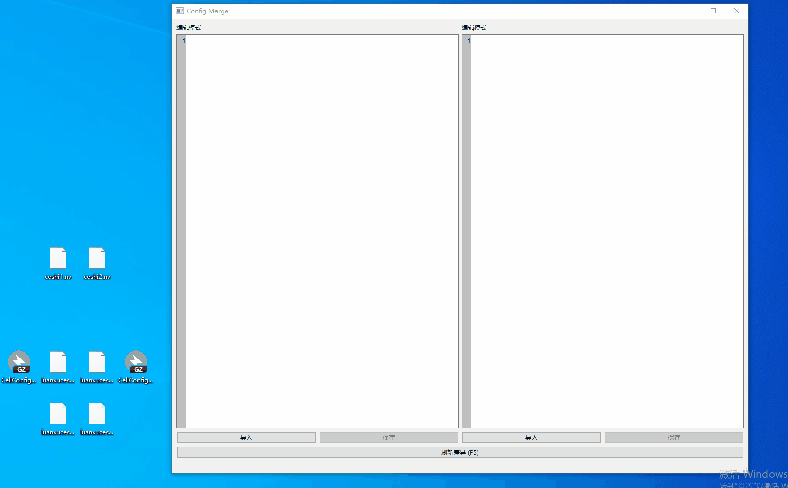
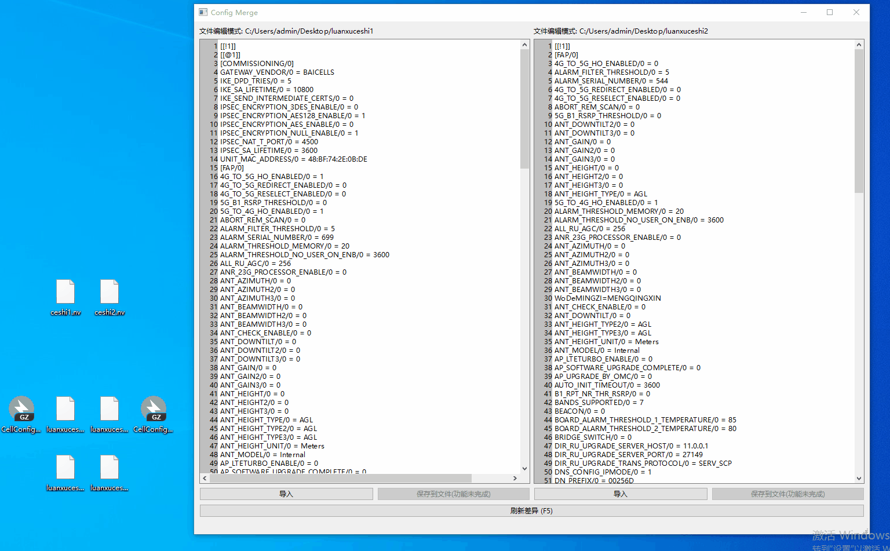
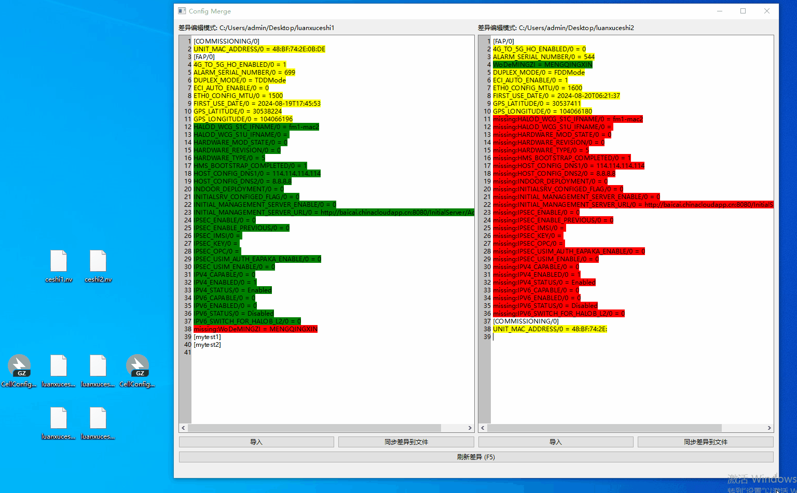
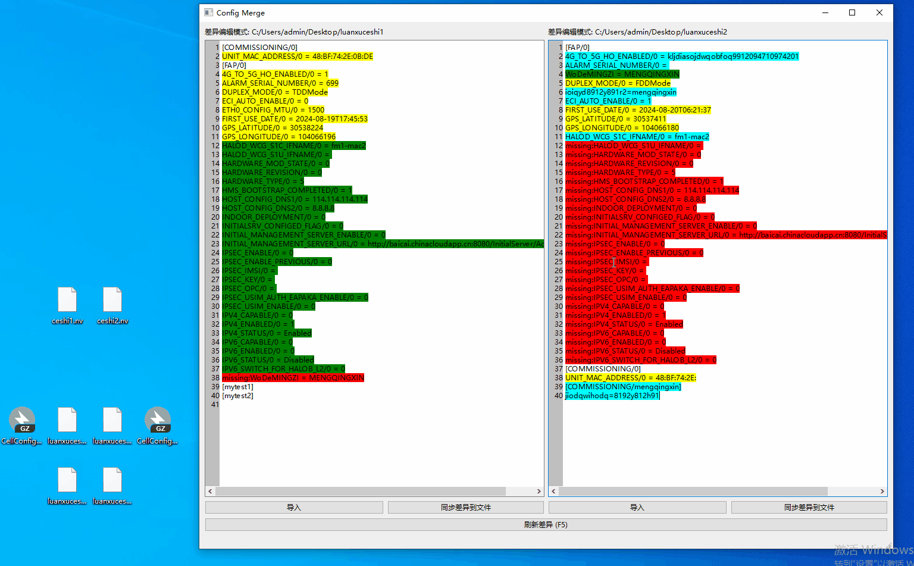

# 启动界面

文本框可以点击导入，也可以直接把文件拖拉进去。

目前可接受文件：gz格式和任何非gz结尾的纯文本文件。目前只能两个文本框都 导入/拖入 后再点击差异分析按钮或使用键盘上的f5分析。

# 差异分析

绿色表示这个文件里有，但另一个文件没有的。

黄色表示两个文件value存在不同的。

红色missing表示这个文件里没有，但另一个文件有的。

# 差异分析后的可用同步操作
- 1.一个键值对的value进行增删改
- 2.增加/删除一行键值对。
- 3.增加一个节点，并为其增加配置；增加的节点如果没有配置，则不会同步到文件。
- 4.通过去掉`missing:`关键字来将一个键值对有效化。

# 简单查询：

选中一个文本框，键盘按下ctrl+f，可以快速查询。

该查询寻找光标下方的第一个配置项（循环查找）。

# 额外说明：

增加的键值对总是加到当前节点的末尾一行。

解析一条配置项时，总是寻找上一个最近的节点作为其节点。

刷新差异总是基于 导入的文件或同步后的文件。

Key中不允许含有等号：因为程序将第一个等号前的所有东西视为key，等号后的所有东西是视为value

在差异比对模式下，同步文件是直接通过文本分析的，显示颜色不符合预期的话则 **不以颜色为准** 。

